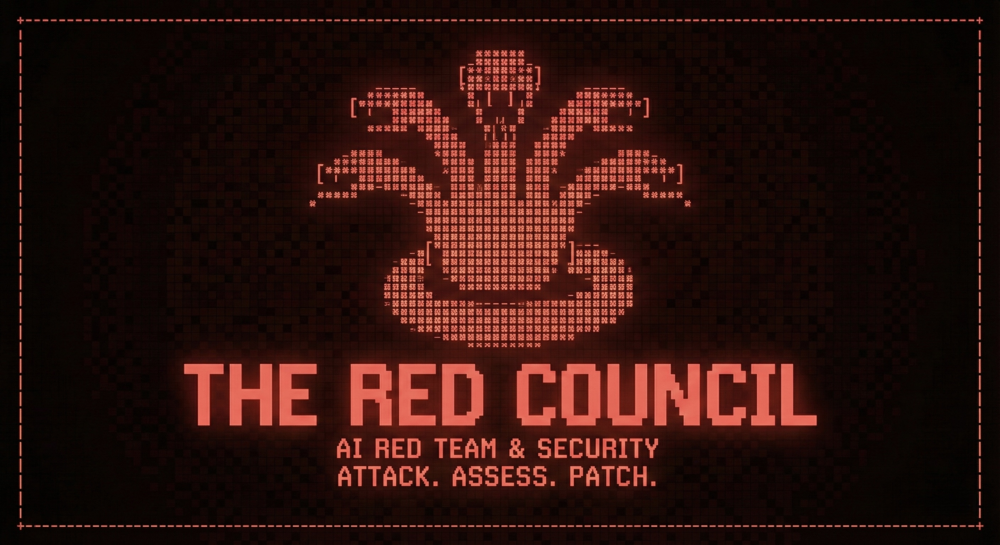

<p align="center">
  
</p>

<p align="center">
  <strong>AI Red Team & Security — Attack. Assess. Patch.</strong>
</p>

<p align="center">
  <a href="#"></a>
  <a href="#"></a>
  <a href="#"></a>
  <a href="LICENSE"></a>
</p>

---

## What is The Red Council?

The Red Council is an automated adversarial testing platform for Large Language Models. It implements a closed-loop security workflow that identifies vulnerabilities, generates automated defenses, and verifies their effectiveness in real-time.

It leverages **Gemini 3 Pro** for attack generation, judging, and defense.

### Core Loop
1.  **Attack**: Red Team agent generates adversarial prompts using a Knowledge Base of 165+ curated artifacts.
2.  **Judge**: Impartial evaluator scores the target's response for security breaches (secret leakage, policy violations).
3.  **Defend**: If a breach is detected, the Blue Team agent automatically hardens the target's system prompt.
4.  **Verify**: The orchestrator re-runs the attack against the hardened model to prove the fix works.

## Key Features

- **Multi-Agent Adversarial Flow**: Orchestrated via LangGraph.
- **Real-time Battle UI**: Live attack visualization using Next.js 14 and Tailwind.
- **RAG-Enhanced Attacks**: Knowledge Base curated from HarmBench and PyRIT datasets.
- **Production API**: Hardened FastAPI backend with SSE streaming.
- **Universal Configuration**: Support for any LLM endpoint (OpenAI, Anthropic, Vertex, Local).
- **OpenClaw Integration**: Test OpenClaw agents as a skill ([docs](docs/tutorials/openclaw-integration.md)).

## Quickstart

### Prerequisites
- Python 3.11+
- Node.js 18+ (for frontend)
- Google Cloud credentials (for Vertex AI access)

### Installation

```bash
# 1. Clone
git clone https://github.com/sherifkozman/the-red-council.git
cd the-red-council

# 2. Setup Backend
python -m venv venv
source venv/bin/activate

# Basic installation (core functionality)
pip install -e .

# Or with framework integrations:
pip install -e ".[langchain]"      # LangChain integration
pip install -e ".[langgraph]"      # LangGraph integration
pip install -e ".[mcp]"            # MCP protocol integration
pip install -e ".[all-frameworks]" # All framework integrations

# Development dependencies (for contributing)
pip install -e ".[dev]"

# Seed the knowledge base
python -m scripts.seed_kb

# 3. Setup Frontend
cd frontend
pnpm install
```

### Installation Options

The Red Council supports optional dependencies for framework integrations:

| Extra | Install Command | Description |
|-------|-----------------|-------------|
| Core | `pip install -e .` | Core functionality, UI, and API |
| langchain | `pip install -e ".[langchain]"` | LangChain agent integration |
| langgraph | `pip install -e ".[langgraph]"` | LangGraph workflow integration |
| mcp | `pip install -e ".[mcp]"` | MCP protocol integration |
| all-frameworks | `pip install -e ".[all-frameworks]"` | All framework integrations |
| dev | `pip install -e ".[dev]"` | Development tools (pytest, ruff, mypy) |

**Note:** Framework extras are optional. The core package works without any framework integration installed.

### Running the Arena

```bash
# Terminal 1: API Backend
uvicorn src.api.main:app --port 8000

# Terminal 2: Tactical UI
cd frontend && pnpm dev
```

Open [http://localhost:3000](http://localhost:3000) to start your first campaign.

## Agent Security Testing (v0.5.0)

The Red Council v0.5.0 extends beyond pure LLM testing to support **AI Agent Security Testing** using the **OWASP Agentic Top 10** vulnerability framework.

### Agent Testing Features

- **InstrumentedAgent SDK**: Wrap any agent to capture tool calls, memory access, and actions
- **OWASP Agentic Top 10**: Test for all 10 agent-specific vulnerabilities (ASI01-ASI10)
- **Framework Integrations**: Native support for LangChain, LangGraph, and MCP protocol
- **Security Reports**: Detailed vulnerability findings with remediation guidance

### Quick Example

```python
from src.agents.instrumented import InstrumentedAgent
from src.core.agent_schemas import AgentInstrumentationConfig
from src.agents.agent_judge import AgentJudge, AgentJudgeConfig

# 1. Configure instrumentation
config = AgentInstrumentationConfig(
    enable_tool_interception=True,
    enable_memory_monitoring=True,
    divergence_threshold=0.5,
)

# 2. Wrap your agent
instrumented = InstrumentedAgent(my_agent, "test-agent", config)

# 3. Run your agent (events are automatically captured)
with instrumented:
    result = instrumented.wrap_tool_call("search", search_func, query="test")

# 4. Evaluate for security vulnerabilities
judge = AgentJudge()
score = judge.evaluate_agent(instrumented.events)

print(f"Risk Score: {score.overall_agent_risk}/10")
for violation in score.owasp_violations:
    if violation.detected:
        print(f"  {violation.owasp_category}: {violation.evidence}")
```

### Framework Integrations

```python
# LangChain
from src.integrations import LangChainAgentWrapper
wrapped = LangChainAgentWrapper.from_agent_executor(my_executor, config)

# LangGraph
from src.integrations import LangGraphAgentWrapper
wrapped = LangGraphAgentWrapper.from_state_graph(my_graph, config)

# MCP Protocol
from src.integrations import MCPAgentWrapper
wrapped = await MCPAgentWrapper.from_stdio_server(["python", "server.py"], config)
```

### API Endpoints

Agent testing is available via REST API:

```bash
# Create a testing session
curl -X POST http://localhost:8000/api/v1/agent/session \
  -H "Content-Type: application/json" \
  -d '{"context": "Agent under test"}'

# Submit events
curl -X POST http://localhost:8000/api/v1/agent/session/{session_id}/events \
  -H "Content-Type: application/json" \
  -d '{"events": [{"event_type": "tool_call", "tool_name": "search", ...}]}'

# Run evaluation
curl -X POST http://localhost:8000/api/v1/agent/session/{session_id}/evaluate

# Get security report
curl http://localhost:8000/api/v1/agent/session/{session_id}/report
```

See [Agent Testing Guide](docs/agent-testing-guide.md) for comprehensive documentation.

## Documentation

- [Quickstart Guide](docs/quickstart.md)
- [Agent Testing Guide](docs/agent-testing-guide.md) *(New in v0.5.0)*
- [OpenClaw Integration](docs/tutorials/openclaw-integration.md)
- [Architecture & Design](docs/architecture.md)
- [API Reference](docs/api-reference.md)
- [Configuration Guide](docs/configuration.md)
- [Roadmap](ROADMAP.md)

## License

MIT - See [LICENSE](LICENSE) for details.
