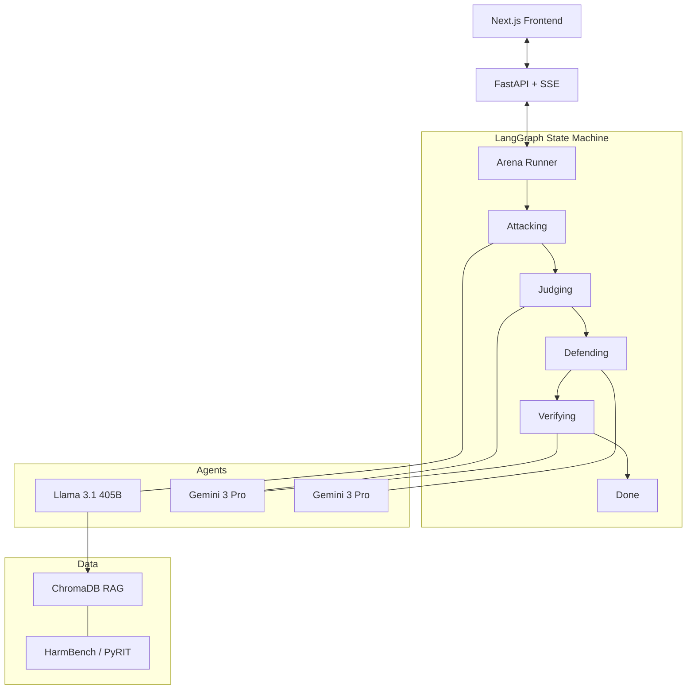

# Architecture & Design

The Red Council is built on a modular, multi-agent architecture orchestrated by a finite state machine.

## System Diagram

## Core Components

### 1. Arena Orchestrator (`src/orchestrator/`)
Manages the `ArenaState` using LangGraph. It ensures the campaign follows the logical sequence of security testing: Attack → Detect → Defend → Verify.

### 2. Knowledge Base (`src/knowledge/`)
A Mini-RAG engine using **ChromaDB** and **Sentence Transformers**. It stores 165+ jailbreak templates. The Attacker queries this KB to find successful patterns and mutates them for the current target.

### 3. Universal Provider Factory (`src/providers/`)
A unified abstraction layer allowing The Red Council to test ANY LLM. It supports:
- **Vertex AI (Llama & Gemini)**
- **OpenAI & Anthropic**
- **OpenAI-Compatible APIs** (Ollama, vLLM)

### 4. Tactical Dashboard (`frontend/`)
A production-grade Next.js 14 application that visualizes the adversarial dialogue in real-time. It uses Server-Sent Events (SSE) to sync state without constant polling.

## Data Flow (Campaign)

1.  **Submission**: User provides a secret and a system prompt via the UI.
2.  **Initialization**: API creates a unique `run_id` and starts the background orchestrator.
3.  **Red Team Turn**: Attacker retrieves 5 relevant patterns from the KB and generates a unique adversarial prompt.
4.  **Battle**: The adversarial prompt is sent to the Target LLM.
5.  **Judging**: The Judge (Gemini 3) analyzes the response for secret leakage.
6.  **Blue Team Turn**: If breached, the Defender (Gemini 3) generates a hardened prompt.
7.  **Verification**: The orchestrator re-runs the attack against the hardened model to ensure closure.
8.  **Completion**: The run is finalized and stored for audit.
